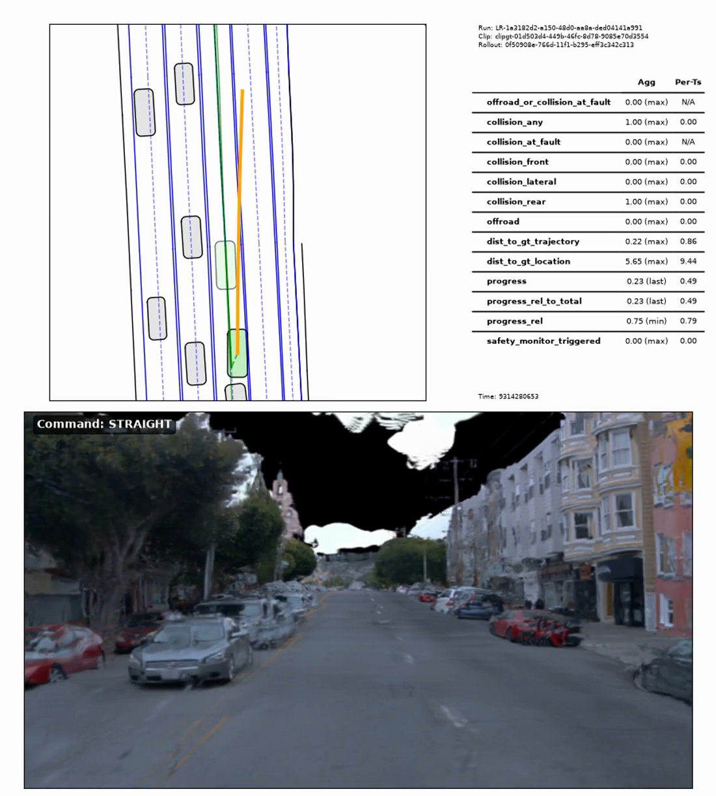
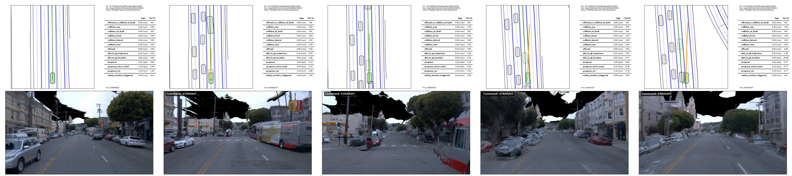
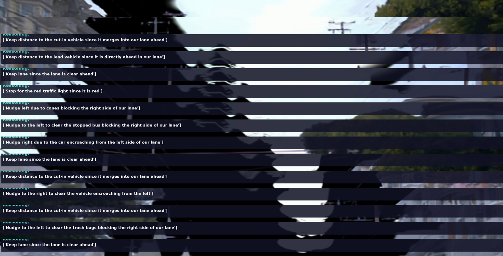

# Splat2Drive

### Closed-Loop Driving Inside Feed-Forward 4D-Gaussian Worlds

**Splat2Drive** takes a short clip from a real self-driving log, rebuilds the
scene as a photoreal 3D world made of **Gaussian splats**, and then lets a
learned driving policy **drive through that reconstructed world in closed loop**
— reacting to what it renders, frame by frame. It wires three existing systems
together with a thin gRPC shim and **zero edits to the simulator's core**.

Here the ego drives a full San Francisco hill block over 20 s: it stops at a red
light and nudges past a bus, cones, and trash bags — objects that exist *only in
the reconstruction* — all rendered from splats.



> `t≈13 s` — **BEV (top-left):** the ego (green) advances along the ground-truth
> route (orange), leaving a trail behind it. **Metrics:** `collision_at_fault
> 0.00`, `offroad 0.00`, lateral `dist_to_gt_trajectory 0.22` (stays in-lane).
> **Camera:** the reconstructed hill street, driven `STRAIGHT`.

---

## Why this is interesting

Closed-loop testing of a driving policy normally needs either a **hand-built
simulator** (expensive, not photoreal) or **log replay** (photoreal, but the
world doesn't react to what the policy does). Splat2Drive gets both at once: the
test world is **reconstructed automatically from a single real clip**, and the
policy's own steering feeds back into what it sees — a reactive, photoreal,
closed loop with no manual scene authoring.

## The moving parts

| Component | What it is | Role here |
| --- | --- | --- |
| **Waymo Open Dataset** | public real driving logs | source clip we reconstruct |
| **DGGT** | feed-forward, pose-free 4D-Gaussian-Splatting reconstructor | turns the clip into a 3D splat world (`.pt` dump) |
| **GS-World** | rendering/simulation toolkit | provides `DGGTRenderBackend` to render the dump from any camera pose |
| **AlpaSim** (NVlabs) | closed-loop AV simulator | runs the rollout; can call an *external* renderer over gRPC |
| **Alpamayo 1.5** (NVIDIA) | 10B vision-language-action driving policy | the "driver" — sees rendered frames, emits reasoning + a trajectory |
| **this repo** | a ~150-line gRPC server + scripts | the glue that lets AlpaSim render from a DGGT dump |

*Acronyms: **BEV** = bird's-eye view, **GT** = ground truth, **CoT** =
chain-of-thought, **VLA** = vision-language-action, **4DGS** = 4D Gaussian
Splatting.*

---

## The result

An earlier run (Waymo *scene003*, an alley) *looked* static because the policy
correctly **stopped behind a stopped lead vehicle**. This run picks **scene007**
— an open SF hill street — so there is room to drive. The ego moves for the full
rollout. Motion is verified three independent ways:

| Evidence | Signal |
| --- | --- |
| **Frame differencing** | first-vs-last frame diff `28.7` vs consecutive `≈6.9` → ~4× cumulative displacement (not jitter) |
| **BEV trail** | ego leaves a growing trajectory behind it along the GT route |
| **Trajectory-prediction panel** | prediction extends **~38 m** longitudinally (near-zero when stopped) |



*Closed-loop camera at start · ¼ · ½ · ¾ · end — Mission Dolores basilica grows
in the distance as the ego advances.*

### Chain-of-thought (13 steps over 20 s)

The policy narrates decisions that reference objects **existing only in the DGGT
reconstruction** — direct evidence it is genuinely consuming the rendered 4DGS
frames:

1. Keep distance to the cut-in vehicle merging into our lane
2. Keep distance to the lead vehicle directly ahead
3. Keep lane — clear ahead
4. **Stop for the red traffic light**
5. **Nudge left** — cones blocking the right
6. **Nudge left** — stopped bus blocking the right
7. **Nudge right** — car encroaching from the left
8. Keep lane — clear
9. Keep distance to cut-in vehicle
10. **Nudge right** — vehicle encroaching from left
11. Keep distance to cut-in vehicle
12. **Nudge left** — trash bags blocking the right
13. Keep lane — clear



### Videos
- [`media/waymo_moving_overlay.mp4`](media/waymo_moving_overlay.mp4) — camera + live reasoning + trajectory-prediction panel, real-time (20 s)
- [`media/waymo_moving_cam.mp4`](media/waymo_moving_cam.mp4) — clean camera only, no overlay

A self-contained visual write-up is in [`docs/index.html`](docs/index.html)
(everything base64-embedded). GitHub won't render it inline — download it and
open locally, or enable **GitHub Pages** (Settings → Pages → `main` / `/docs`).

---

## How it works

```
Waymo front camera frames
      │  (already pinhole — no undistort needed)
      ▼
DGGT  mode=3 --dump_gs           feed-forward, pose-free 4DGS
      │   → 001_gaussians_dump.pt (17.9M static gaussians, T=197)
      ▼
DGGTRenderBackend  (GS-World)    _render_w2c(w2c, K, frame_idx) → RGB
      │
      ▼
server/server.py                 gRPC WorldModelService (this repo)
      │   :50051, playback mode: session-relative time → dump frame
      ▼
AlpaSim  deploy=external_video_model  driver=alpamayo1_5_1cam
      │   Docker driver reaches the host server over the LAN
      ▼
Alpamayo 1.5 (10B)  closed-loop  sees splat frames, emits CoT + trajectory
```

The only new code is an **additive** gRPC server: a subclass of AlpaSim's
generated `WorldModelServiceServicer` implementing four methods
(`get_version` / `start_session` / `render_video_chunk` / `close_session`).
AlpaSim is otherwise stock.

**Key facts**
- **DGGT is pinhole-only** (pose encoding `absT_quaR_FoV`, no distortion term).
  Waymo is already pinhole, so no undistortion step is needed (unlike NVIDIA
  f-theta fisheye scenes, which must be undistorted first).
- **Playback mode:** the render camera follows the dump's own logged trajectory,
  indexed by session-relative time. `--clip_duration 20.0` maps rollout time
  across *all* dump frames (without it the camera freezes early).
- **Timestamp anchoring:** AlpaSim's pose timestamps are absolute sim-epoch
  microseconds; the server anchors `t0` on the first pose of a session so the
  frame index advances smoothly (this fixed an earlier frozen-camera bug).

---

## Repository layout

```
server/
  server.py               DGGT WorldModelService gRPC server (the additive glue)
  run_server_generic.sh   launch the server:  run_server_generic.sh <dump.pt> <gpu>
render/
  render_full_playback.py render a dump along its logged camera → PNG frames
  sanity_generic.py       quick start/mid/end strip from a dump
alpasim/
  run_s007_e2e.sh         the AlpaSim closed-loop launch (external_video_model)
viz/
  build_waymo_moving_html.py  base64-embeds the media into docs/index.html
docs/
  index.html              self-contained visual write-up
media/                    hero, motion strip, reasoning timeline, mp4s
```

---

## Prerequisites

This repo is **glue only** — it does not vendor the models or datasets. You need
your own working installs of:

- **DGGT** + **GS-World** (the `dggt` conda env below imports
  `gs_world.simulation.dggt_render_backend`),
- **AlpaSim** (provides `alpasim_wizard` and the `alpasim_grpc` protobufs),
- the **Alpamayo 1.5** checkpoint, and
- one or more clips from the **Waymo Open Dataset**.

The scripts read machine-specific locations from environment variables — nothing
is hard-coded:

| Variable | Used by | Meaning |
| --- | --- | --- |
| `GS_WORLD_ROOT` | server, render | path to your GS-World checkout (default `/home/ubuntu/GS-World`) |
| `ALPASIM_DIR` | `run_s007_e2e.sh` | path to your AlpaSim checkout |
| `RENDERER_HOST` | `run_s007_e2e.sh` | `host:port` the Docker driver reaches the server at — the host's **LAN IP**, not `localhost` |
| `CHECKPOINT` | `run_s007_e2e.sh` | path to the Alpamayo-1.5-10B checkpoint |

---

## Setup

The **render server** (this repo's core) runs in a conda env that can import
GS-World. Everything else (AlpaSim, Docker, the Alpamayo checkpoint) lives in
your AlpaSim install and is only needed for the full closed loop.

```bash
# server env — Python deps beyond a working GS-World + gsplat install:
conda activate dggt          # your GS-World env
pip install grpcio pillow imageio numpy    # torch is already there for GS-World
```

**Make `alpasim_grpc` importable in the server env.** `server.py` imports the
protobufs AlpaSim generates (`alpasim_grpc.v0`). Installing AlpaSim into the env
is the clean way. If you can't, point Python at AlpaSim's generated gRPC dir —
but note its `__init__.py` calls `importlib.metadata.version("alpasim_grpc")`, so
it also needs a package record or it raises at import:

```bash
SP=$(python -c "import site; print(site.getsitepackages()[0])")
echo "/path/to/alpasim/src/grpc" > "$SP/alpasim_grpc.pth"          # importable
mkdir -p "$SP/alpasim_grpc-0.0.0.dist-info"                        # satisfies metadata.version()
printf 'Metadata-Version: 2.1\nName: alpasim_grpc\nVersion: 0.0.0\n' \
  > "$SP/alpasim_grpc-0.0.0.dist-info/METADATA"
```

### Smoke test (no AlpaSim, no Alpamayo)

Fastest check that the dump + GS-World backend render at all — makes a
start/mid/end strip straight from a dump:

```bash
export GS_WORLD_ROOT=/path/to/GS-World
python render/sanity_generic.py /path/to/scene007/001_gaussians_dump.pt strip.png scene007
# → writes strip.png (three rendered frames); prints the dump's frame count
```

---

## Reproduce (full closed loop)

```bash
# 1) Build a DGGT 4DGS dump from Waymo front-camera frames (in the DGGT repo)
python inference.py mode=3 --dump_gs        # → 001_gaussians_dump.pt

# 2) Start the render server (host machine, dggt conda env)
export GS_WORLD_ROOT=/path/to/GS-World
server/run_server_generic.sh /path/to/scene007/001_gaussians_dump.pt 3   # <dump> <gpu>

#    verify it answers BEFORE launching AlpaSim (else the runtime probe times out):
python -c "import grpc; from alpasim_grpc.v0 import video_model_pb2_grpc as g, common_pb2 as c; \
  print(g.WorldModelServiceStub(grpc.insecure_channel('HOST:50051')).get_version(c.Empty()))"
#    expect: version_id: "dggt-wms-0.1"

# 3) Run Alpamayo closed-loop against it (needs your AlpaSim install)
export ALPASIM_DIR=/path/to/alpasim
export RENDERER_HOST=<host-LAN-IP>:50051      # host's LAN IP, NOT localhost (driver is in Docker)
export CHECKPOINT=/path/to/Alpamayo-1.5-10B
bash alpasim/run_s007_e2e.sh
#    outputs land in $ALPASIM_DIR/s007_e2e/rollouts/... (rollout.asl + *_reasoning_overlay.mp4)

# 4) Rebuild the write-up page
python viz/build_waymo_moving_html.py       # → docs/index.html
```

---

## Caveats (Tier-0)

- **This proves the plumbing + perception, not a benchmark score.** The
  map / GT / actor scaffold is a stand-in that does not exactly match this scene,
  so **absolute metrics are not meaningful** — the point is that the policy
  perceives reconstruction-only objects and drives coherently.
- `collision_any 1.00` is a *rear* event and **not at fault** (`collision_at_fault 0.00`).
- `dist_to_gt_location` (5.65) grows from a speed/timing offset; lateral
  `dist_to_gt_trajectory` (0.22) stays tight — it followed the lane.
- The server renders **pinhole**; Alpamayo nominally expects f-theta. The
  intrinsic mismatch is tolerable for perception here; matching it (gsplat
  `ftheta_coeffs` on output) is future work.
- **DGGT recon quality tracks ego baseline** — moving scenes reconstruct well;
  dense stop-and-go (low parallax) reconstructs poorly.

---

## Environment notes

- Server runs in a `dggt` conda env (GS-World + gsplat). gsplat's JIT build on an
  RTX PRO 6000 Blackwell needs `TORCH_CUDA_ARCH_LIST=12.0` and
  `CPATH=$CUDA_HOME/targets/x86_64-linux/include` (see `run_server_generic.sh`);
  adjust the conda paths in that script for your machine.
- AlpaSim's Docker driver reaches the host server via the host's **LAN IP**
  (not `localhost`).
- Wait for the server to finish `torch.load` (large dump) and answer
  `get_version` before launching AlpaSim, or the runtime probe hits
  `DEADLINE_EXCEEDED`.

---

## Attribution & license

This repository is **integration glue + a write-up**. It does not redistribute
any third-party models, weights, or datasets:

- **Alpamayo 1.5** — © NVIDIA
- **AlpaSim** — © NVlabs
- **DGGT** / **GS-World** — © their respective authors
- **Waymo Open Dataset** — © Waymo LLC (imagery shown is reconstructed from it)

Use each under its own license/terms. The glue code and scripts here are provided
as-is for research use.
